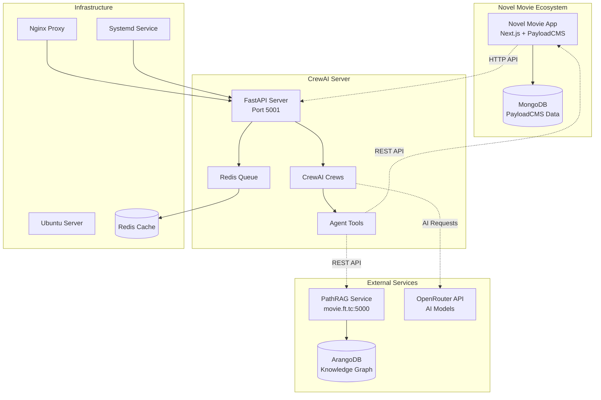
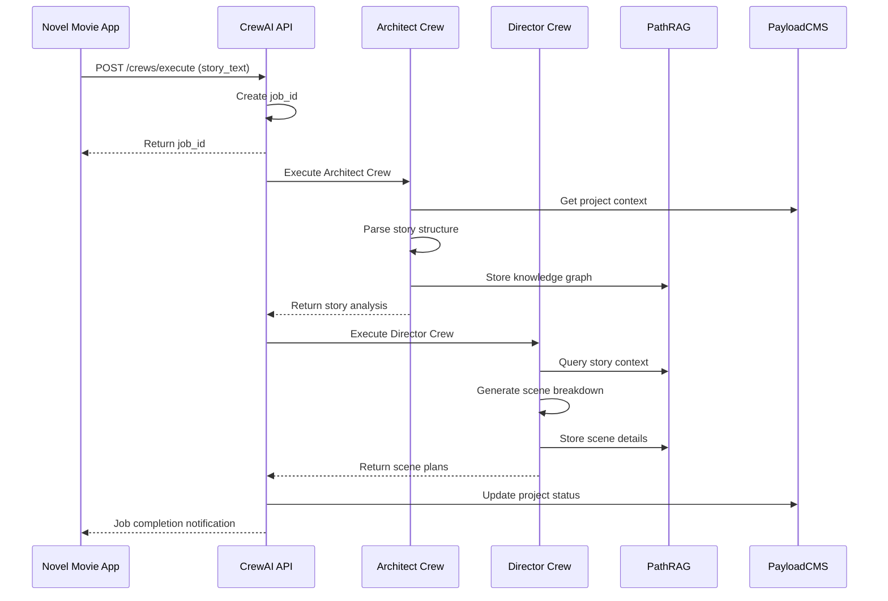

# System Architecture Overview

## 🏗️ High-Level Architecture

The Novel Movie CrewAI Server is designed as a microservice that orchestrates AI agents for movie production tasks. It integrates with the main Novel Movie application and external services to provide intelligent story analysis and production planning.

## 🎯 Core Components

### 1. FastAPI Server
- **Purpose**: HTTP API gateway and request orchestration
- **Port**: 5001 (configurable)
- **Features**: 
  - Async request handling
  - Background task processing
  - Health monitoring
  - Error handling and logging

### 2. CrewAI Framework
- **Purpose**: Multi-agent AI orchestration
- **Components**:
  - **Crews**: Collections of specialized agents
  - **Agents**: Individual AI workers with specific roles
  - **Tasks**: Structured work assignments
  - **Tools**: External service integrations

### 3. Agent Tools
- **PathRAG Tool**: Knowledge graph operations
- **PayloadCMS Tool**: Novel Movie data access
- **Custom Tools**: Extensible tool system

### 4. Queue System
- **Technology**: Redis-based job queuing
- **Purpose**: Async task processing and job tracking
- **Features**: Job status tracking, error recovery, scalability

## 🔄 Data Flow

### Story Processing Workflow

### Request/Response Flow

1. **Request Initiation**: Novel Movie app sends crew execution request
2. **Job Creation**: API creates unique job ID and queues task
3. **Crew Execution**: Appropriate crew processes the request
4. **Tool Integration**: Crews use tools to access external services
5. **Result Processing**: Results are formatted and stored
6. **Status Updates**: Job status and results are made available

## 🧩 Service Integration

### PathRAG Integration
- **Purpose**: Knowledge graph storage and intelligent querying
- **Capabilities**:
  - Story element extraction and storage
  - Semantic search and retrieval
  - Relationship mapping
  - Context-aware querying

### Novel Movie API Integration
- **Purpose**: Access to project data and story content
- **Operations**:
  - Project configuration retrieval
  - Story content access
  - Status updates
  - Result storage

### OpenRouter Integration
- **Purpose**: AI model access for crew agents
- **Models**: Claude Sonnet 4, GPT-4, Gemini Pro
- **Features**: Model routing, cost optimization, fallback handling

## 🏛️ Architectural Principles

### 1. Microservice Design
- **Single Responsibility**: Focus on AI agent orchestration
- **Loose Coupling**: Independent of Novel Movie app internals
- **API-First**: Clean REST API interface

### 2. Async Processing
- **Non-Blocking**: Long-running AI tasks don't block API
- **Scalable**: Handle multiple concurrent requests
- **Resilient**: Graceful handling of failures

### 3. Extensibility
- **Modular Crews**: Easy to add new agent types
- **Plugin Tools**: Extensible tool system
- **Configurable**: Environment-based configuration

### 4. Production Ready
- **Monitoring**: Health checks and metrics
- **Logging**: Structured logging for debugging
- **Security**: Input validation and error handling
- **Deployment**: Docker and systemd support

## 📊 Scalability Considerations

### Horizontal Scaling
- **Load Balancing**: Multiple server instances behind load balancer
- **Shared State**: Redis for job state sharing
- **Database**: Shared PathRAG and Novel Movie databases

### Vertical Scaling
- **CPU**: Multi-core processing for concurrent crews
- **Memory**: Efficient memory usage for large language models
- **I/O**: Async operations for external service calls

### Performance Targets
- **Response Time**: < 5 seconds for API responses
- **Throughput**: 100+ concurrent requests
- **Availability**: 99.9% uptime
- **Error Rate**: < 1% failed requests

## 🔒 Security Architecture

### API Security
- **Authentication**: API key-based authentication
- **Input Validation**: Pydantic model validation
- **Rate Limiting**: Request throttling
- **CORS**: Configurable cross-origin policies

### Infrastructure Security
- **Network**: Firewall configuration
- **SSL/TLS**: HTTPS encryption
- **User Isolation**: Dedicated service user
- **File Permissions**: Restricted file access

## 🔧 Configuration Management

### Environment-Based Config
- **Development**: Local development settings
- **Staging**: Pre-production testing
- **Production**: Optimized production settings

### Configuration Sources
1. Environment variables (.env file)
2. Command line arguments
3. Configuration files
4. Default values

## 📈 Monitoring & Observability

### Health Monitoring
- **Health Endpoints**: `/health` for service status
- **Metrics Endpoints**: `/stats` for performance data
- **Dependency Checks**: External service connectivity

### Logging Strategy
- **Structured Logging**: JSON-formatted logs
- **Log Levels**: DEBUG, INFO, WARNING, ERROR
- **Log Aggregation**: Centralized log collection
- **Log Retention**: Configurable retention policies

### Performance Monitoring
- **Response Times**: API endpoint performance
- **Resource Usage**: CPU, memory, disk utilization
- **Error Rates**: Failed request tracking
- **Queue Metrics**: Job processing statistics

---

This architecture provides a solid foundation for the Novel Movie CrewAI Server while maintaining flexibility for future enhancements and scaling requirements.
