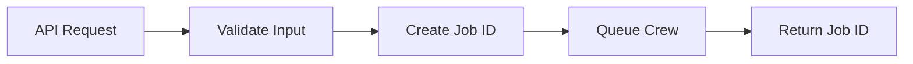
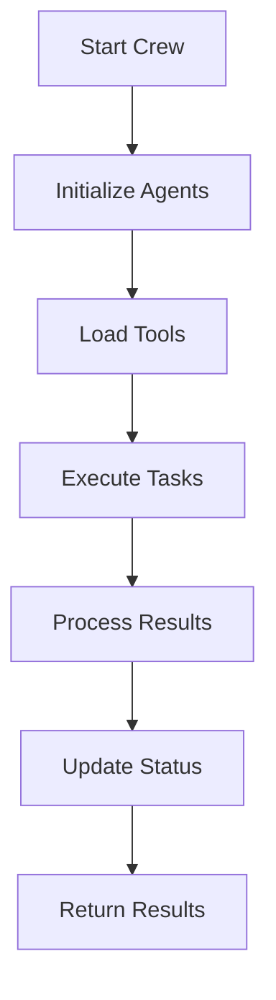
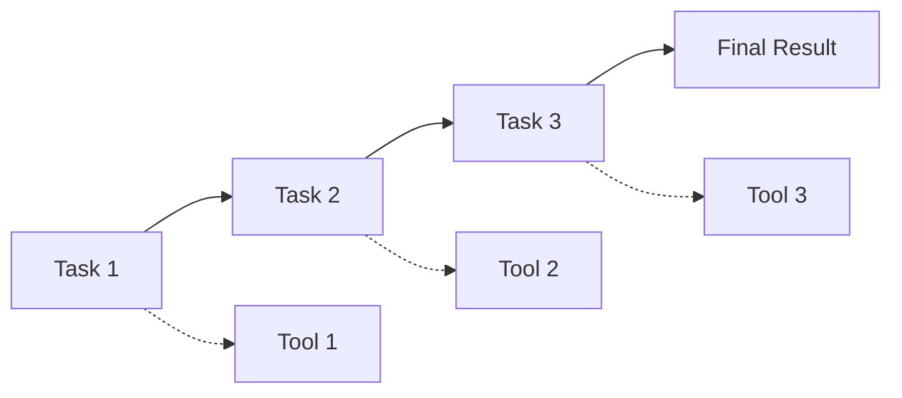

# CrewAI Crews Overview

Understanding the crew system in the Novel Movie CrewAI Server.

## 🎭 What are Crews?

Crews are collections of specialized AI agents that work together to accomplish complex tasks. Each crew is designed for a specific phase of movie production, from story analysis to technical planning.

## 🏗️ Crew Architecture

### Base Crew Structure
All crews inherit from the `BaseCrew` class, which provides:
- **Async Execution**: Non-blocking task processing
- **Tool Integration**: Access to external services
- **Error Handling**: Robust error recovery
- **Result Processing**: Structured output formatting
- **Logging**: Comprehensive activity tracking

### Crew Components
Each crew consists of:
1. **Agents**: Individual AI workers with specific roles
2. **Tasks**: Structured work assignments
3. **Tools**: External service integrations
4. **Configuration**: Customizable parameters

## 🎬 Available Crews

### 1. Architect Crew (Phase 1)
**Purpose**: Story structure analysis and knowledge graph creation

**Agents**:
- **Story Structure Analyst**: Parses narrative elements
- **Knowledge Graph Architect**: Creates structured relationships

**Capabilities**:
- Scene identification and breakdown
- Character analysis and mapping
- Location and setting extraction
- Theme identification
- Knowledge graph creation in PathRAG

**Input**: Story text, user preferences
**Output**: Structured story analysis, knowledge graph

### 2. Director Crew (Phase 2)
**Purpose**: Scene breakdown and shot planning

**Agents**:
- **Scene Analysis Director**: Analyzes scenes for visual storytelling
- **Cinematography Specialist**: Creates detailed shot lists

**Capabilities**:
- Scene-by-scene breakdown
- Camera angle and movement planning
- Lighting and mood specifications
- Technical requirement analysis
- Production planning

**Input**: Story structure from Phase 1
**Output**: Detailed shot lists, production requirements

### 3. Specialist Crews (Phase 3) - Future
**Purpose**: Technical and artistic specialization

**Planned Crews**:
- **Cinematographer Crew**: Advanced camera work
- **Art Director Crew**: Visual design and assets
- **Sound Designer Crew**: Audio planning
- **VFX Crew**: Visual effects planning

### 4. Supervisor Crew (Phase 4) - Future
**Purpose**: Quality control and consistency

**Capabilities**:
- Cross-crew validation
- Consistency checking
- Quality assurance
- Final review and approval

## 🔧 Crew Configuration

### Standard Configuration
```json
{
  "temperature": 0.7,        // AI creativity level
  "verbose": true,           // Detailed logging
  "max_iterations": 3,       // Task retry limit
  "timeout": 300,            // Execution timeout
  "model": "anthropic/claude-sonnet-4"  // AI model
}
```

### Crew-Specific Settings
Each crew can have specialized configuration:

**Architect Crew**:
```json
{
  "enable_semantic_search": true,
  "include_emotional_analysis": true,
  "create_character_arcs": true,
  "map_thematic_elements": true
}
```

**Director Crew**:
```json
{
  "style": "cinematic",
  "pacing": "medium",
  "complexity": "moderate",
  "shot_detail_level": "high"
}
```

## 🔄 Crew Execution Flow

### 1. Request Processing


### 2. Crew Execution


### 3. Task Coordination


## 🛠️ Tools Integration

### Available Tools
1. **PathRAG Tool**: Knowledge graph operations
2. **PayloadCMS Tool**: Novel Movie data access
3. **Custom Tools**: Extensible tool system

### Tool Usage Pattern
```python
# Example tool usage in crew
result = await self.pathrag_tool.query_story(
    project_id=self.project_id,
    query="Get all characters in the story"
)
```

## 📊 Performance Characteristics

### Execution Times
- **Architect Crew**: 2-5 minutes (typical story)
- **Director Crew**: 3-7 minutes (depends on scene count)
- **Specialist Crews**: 1-3 minutes each (parallel execution)

### Resource Usage
- **CPU**: Moderate (mainly API calls)
- **Memory**: Low to moderate (depends on story size)
- **Network**: High (AI model API calls)

### Scalability
- **Concurrent Crews**: Up to 10 simultaneous executions
- **Queue Capacity**: 100+ queued jobs
- **Horizontal Scaling**: Multiple server instances supported

## 🎯 Best Practices

### Crew Design
1. **Single Responsibility**: Each crew focuses on one production phase
2. **Clear Interfaces**: Well-defined inputs and outputs
3. **Error Resilience**: Graceful handling of failures
4. **Modularity**: Reusable components across crews

### Agent Design
1. **Specific Roles**: Clear agent responsibilities
2. **Expert Personas**: Domain-specific knowledge and language
3. **Tool Integration**: Effective use of available tools
4. **Collaboration**: Agents work together effectively

### Task Design
1. **Clear Instructions**: Detailed task descriptions
2. **Expected Outputs**: Specific result formats
3. **Success Criteria**: Measurable completion standards
4. **Error Handling**: Fallback strategies

## 🔍 Monitoring & Debugging

### Crew Monitoring
```bash
# Check crew status
curl http://localhost:5001/crews/status/{job_id}

# Monitor server stats
curl http://localhost:5001/stats

# View execution logs
sudo journalctl -u crewai-server -f
```

### Performance Metrics
- **Success Rate**: Percentage of successful executions
- **Average Execution Time**: Performance benchmarks
- **Error Rates**: Failure analysis
- **Resource Utilization**: System resource usage

### Common Issues
1. **Timeout Errors**: Increase timeout configuration
2. **Tool Failures**: Check external service connectivity
3. **Memory Issues**: Optimize crew configuration
4. **API Limits**: Monitor OpenRouter usage

## 🚀 Future Enhancements

### Planned Features
1. **Dynamic Crew Composition**: Runtime agent selection
2. **Crew Templates**: Pre-configured crew setups
3. **Workflow Orchestration**: Multi-crew pipelines
4. **Real-time Collaboration**: Live crew coordination

### Extensibility
1. **Custom Crews**: User-defined crew types
2. **Plugin System**: Third-party integrations
3. **Workflow Builder**: Visual crew design
4. **API Extensions**: Custom tool development

---

For detailed information about specific crews, see:
- [Architect Crew](./architect-crew.md)
- [Director Crew](./director-crew.md)
- [Custom Crews](./custom-crews.md)
